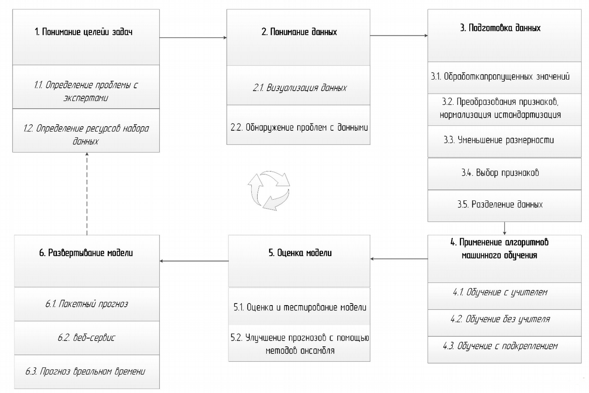

****
# Введение 

Благодаря достижениям в области искусственного интеллекта в последние годы открываются новые области применения методов и алгоритмов машинного обучения. В то время как проекты машинного обучения различаются по размеру и сложности, требуя различных навыков работы с данными, их общая структура как правило одинакова. Можно констатировать, что для получения хороших результатов анализа, важно иметь хорошо подобранные данные и команду экспертов, обладающую необходимыми навыками для управления проектом машинного обучения. В этом исследовании мы будем следовать конвейеру машинного обучения, состоящему из шести ступеней.

**Последовательность этапов конвейера машинного обучения**

## Алгоритмы предварительной обработки данных 

Предварительная обработка данных - это метод анализа данных, который включает преобразование необработанных данных в понятный формат. Реальные данные часто являются неполными, непоследовательными и/или недостающими в определенных видах поведения или тенденциях, могут содержать много ошибок. Предварительная обработка данных является проверенным методом решения таких проблем. Поскольку это важно для успеха любого процесса машинного обучения, мы дадим краткое описание основных методов предварительной обработки данных, включая:

1) обработку пропущенных значений;

2) преобразование признаков, нормализацию и стандартизацию;

3) уменьшение размерности;

4) выбор признаков;

5) разделение данных.

Во-первых, сначала выполняется очистка данных, которая включает в себя вменения пропущенных значений и отбрасывание всех данных, которые имеют поврежденные значения или значения выбросов. Это требует высокого знания предметной области. Например, искаженные значения могут быть вызваны сбоем в работе механизма, который сгенерировал набор данных, или лицом, ответственным за запись данных. Только специалисты с высоким уровнем знаний в области могут определить, какие значения следует опускать, а какие показывают целесообразное измерение. Пропущенные значения обычно заменяются некоторыми правдоподобными значениями, такими как среднее или наиболее частое значение столбца.

Затем выполняется масштабирование объектов, чтобы поместить весь набор данных в один общий интервал. Очень важно, чтобы диапазон всех атрибутов был нормализован, чтобы каждый атрибут вносил одинаковый вклад в конечный результат [[1]](https://arxiv.org/abs/1811.03402). Это не должно влиять на тип категориальных атрибутов. Некоторыми популярными методами масштабирования функций являются нормализация мин-макс, нормализация среднего значения, логарифмическое преобразование и стандартизация атрибутов.

После выполняется разработка признаков. Разработка признаков в основном означает сохранение наиболее важных признаков для достижения желаемой цели. Это можно сделать извлекая новые признаки из имеющихся в настоящее время признаки или удаляя признаки, которые не влияют на результат или добавляют шум, что приводит к снижению точности результатов.

Разделение данных - это разделение доступных данных на две или три части; обычно для перекрестных проверочных целей. Одна часть данных используется для разработки модели, а другая - для оценки производительности модели. Это сделано для предотвращения переобучения и улучшения способности модели работать с новыми данными.

## Алгоритмы машинного обучения 

Выбор правильного алгоритма является ключевой частью любого проекта по машинному обучению, и, поскольку есть десятки вариантов на выбор, важно понять их сильные и слабые стороны в различных бизнес-приложениях [[2]](https://www.researchgate.net/publication/316273553_A_Survey_on_Machine_Learning_Concept_Algorithms_and_Applications). В этом курсе мы поговорим об алгоритмах в двух видах обучения: 

- Обучение с учителем, 
   
- Обучение без учителя.

### Обучение с учителем 

Алгоритмы обучения с учителем (контролируемого обучения) строят математическую модель набора данных, который содержит как входы, так и желаемые результаты. Этот набор известен как данные обучения и состоит из обучающих примеров. Каждый обучающий пример имеет один или несколько входов и желаемый выход, также известный как контрольный сигнал. В случае полуобучаемых алгоритмов, обучения в некоторых учебных примерах отсутствует желаемый результат. В математической модели каждый обучающий пример представлен массивом или вектором, а обучающие данные матрицей. Посредством итеративной оптимизации целевой функции, алгоритмы обучения с учителем изучают функцию, которая может использоваться для прогнозирования результатов, связанных с новыми входными данными. Оптимальная функция позволит алгоритму правильно определять выходные данные для входов, которые не были частью обучающих данных. 

Говорят, что алгоритм, улучшающий точность результатов или прогнозов с течением времени, научился выполнять эту задачу. Алгоритмы обучения с учителем включают классификацию и регрессию. Алгоритмы классификации используются, когда выходные данные ограничены ограниченным набором значений, а алгоритмы регрессии используются, когда выходные данные могут иметь любое числовое значение в пределах диапазона. Обучение сходству является областью контролируемого машинного обучения, тесно связанной с регрессией и классификацией, но цель состоит в том, чтобы учиться на примерах с использованием функции сходства, которая измеряет, насколько похожи или связаны два объекта. Оно имеет приложения для ранжирования, системы рекомендаций, визуального отслеживания личности, проверки лица и проверки докладчика.

### Обучение без учителя 

Алгоритмы обучения без учителя берут набор данных, который содержит только входные данные, и находят структуру данных, такую ​​как группировка или кластеризация точек данных. Алгоритмы поэтому учатся на тестовых данных, которые не были помечены, классифицированы или разделены на кластеры. Вместо того, чтобы реагировать на обратную связь, неконтролируемые алгоритмы обучения выявляют общие черты в данных и реагируют на основании наличия или отсутствия таких общих черт в каждом новом фрагменте данных. 

*Кластерный анализ* - это распределение набора наблюдений в подмножества (называемые кластерами), чтобы наблюдения в пределах одного кластера были похожи в соответствии с одним или несколькими заранее определенными критериями, в то время как наблюдения, полученные из разных кластеров, отличаются. Различные методы кластеризации делают разные предположения о структуре данных, часто определяемые некоторой метрикой сходства и оцениваемые, например, по внутренней компактности или сходству между членами одного кластера и различию - разнице между кластерами. Другие методы основаны на оценке плотности и связности графа.

****
## Типовая вычислительная инфраструктура для машинного обучения  

> 
>Под типовой системой машинного обучения в данном конкурсе понимается :
> 

-   ...
-   .

Примером подобной системы является структура, представленная на следующем рисунке.

****
## Проект хакатона 

Всем командам предлагается собрать template-проект, который может быть модифицирован для реализации собственных идей.
В проекте использовано следующее оборудование:

-   Облачная платформа `IBM Cloud Private` используется для реализации сервисов аналитической обработки и визуализации данных о пациентах в приватном медицинском учреждении (с возможностью полного доступа к персональной информации).

Система работает следующим образом. 

 

****
## Оборудование и настройка компьютера разработчика 

В ходе хакатона организаторы предоставят участникам следующее оборудование:

* ...

Требования к оборудованию разработкика:

* Учатник хакатона может выполнить все задания на компьютере в аудитории, однако рекомендуется использовать собственный ноутбук. Желательно использование операционной системы Linux (Ubuntu, Arch, CentOS, RHEL) или MacBook. В случае использования компьютера под управлением OC Windows рекомендуется воспользоваться готовым образом виртуальной машины Oracle Virtual Box, который можно найти на портале: [https://www.osboxes.org/ubuntu/](https://www.osboxes.org/ubuntu/).

