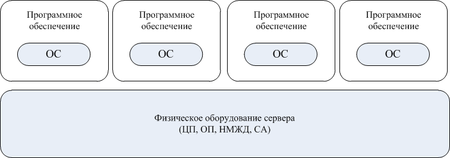

****
# День 1. Управление виртуальным ЦОД 

Понятие виртуализации в широком смысле представляет собой сокрытие настоящей реализации какого-либо объекта или процесса от истинного его представления для пользователя. Результатом виртуализации является нечто удобное для использования, на самом деле, имеющее более сложную или совсем иную структуру, отличную от той, которая воспринимается при работе с объектом. Происходит отделение представления от реализации. В компьютерных технологиях под термином «виртуализация» обычно понимается абстракция вычислительных ресурсов (чаще всего серверов) и предоставление пользователю системы, которая «инкапсулирует» (скрывает в себе) собственную реализацию. Проще говоря, пользователь работает с удобным для себя представлением объекта, и для него не имеет значения, как объект устроен в действительности.

**Виртуальные машины, работающие на физическом оборудовании**

Долгое время в центрах обработки данных стремились к децентрализованной архитектуре, масштабированию приложений и системной инфраструктуры в горизонтальном направлении. Эта тенденция, как правило, приводила к росту числа серверов. Со временем инфраструктура ЦОД становилась все более сложной, что сказывалось на возможности его модернизации, обслуживании, стоимости и пр. Централизованная архитектура может уменьшить количество серверов и увеличить степень использования оборудования при сравнимой производительности, а так же уменьшить стоимость владения оборудованием. 

`Частичная виртуализация` (нативная виртуализация) базируется на принципе эмуляции только необходимого количества ресурсов, чтобы виртуальная машина могла быть запущена изолировано. Например, при полной эмуляции различных архитектур, гостевая система работает с определенной специфической системой команд процессора, отличной от системы команд процессора хостовой системы. Каждую команду процессору гостевой системы нужно транслировать в соответствующую команду хостовой системы, что невероятно уменьшает быстродействие. При использовании нативной виртуализации никакой трансляции команд не происходит, так как гостевая операционная система разработана под ту же архитектуру, на которой работает хостовая система. Это позволяет значительно повысить быстродействие гостевой системы и максимально приблизить его к быстродействию реальной системы.
Для повышения быстродействия нативной виртуализации применяется специализированная программная прослойка – `гипервизор`. Гипервизор является посредником между гостевой операционной системой и физическим аппаратным обеспечением. Он позволяет гостевой системе напрямую обращаться к аппаратным ресурсам, что и является секретом высокого быстродействия данного вида виртуализации. Гипервизор является одним из ключевых понятий в мире виртуализации.

Частичная эмуляция является самым распространенным видом виртуализации в наше время. Основным ее недостатком является зависимость виртуальных машин от конкретной аппаратной архитектуры [3].
Примеры продуктов для частичной эмуляции: `VMware Workstation, VMware Server, VMware ESXI Server, Virtual Iron, Microsoft Hyper-V Server, Microsoft Virtual PC, Sun VirtualBox, Parallels Desktop` и другие.

В хакатоне мы будем использовать ЦОД под управлением гипервизора `ESXi 6.5` и платформы централизованного управления `VMware vCenter`.

Описание ESX

Описание пула ресурсов

Для выполнения заданий хакатона для каждой команды выделен пул виртуальных ресурсов:

- Оперативная память:  8 ГБ.

- Эквивалентная микропроцессорная частота: 2400 МГц.

- Объем дискового пространства 50 ГБ.

****
## Доступ к виртальному ЦОД 

Для доступа к выделенному для команды пула ресурсов необходимо открыть страницу по адресу:

* `https://195.19.40.127/vsphere-client/?csp`

Для доступа необходимо использовать логин и пароль, предоставленные организаторами хакатона.

**Доступ к VMware vCenter**

