****
# День 5. Облачная платформа IBM Cloud и платформа ИИ Watson Studio <a name="6"></a>


В этом задании мы рассмотрим средства машинного обучения и ИИ, развернутые на облачной платформе IBM Cloud. 

Для вычислений мы будем использовать платформу IBM Watson Studio, доступную студентам и преподаватеям МГТУ по академической программе IBM.

Набор средств машинного обучения и анализа данных Watson Studio очень широк и позволяет решать задачи ИИ, в том числе с использованием распределенных вычислений и GPGPU.

Для знакомства с имеющимися средства машинного обучения и анализа данных следует ознакомиться с инструкцией: [Choosing a tool in Watson Studio](https://dataplatform.cloud.ibm.com/docs/content/wsj/getting-started/tools.html?audience=wdp&context=wdp)


## Регистрация в IBM Cloud и получение студенческого промо-кода <a name="6_1"></a>

Для доступа к ресурсам IBM Watson Studio необходимо:

- Получить почтовый адрес из домена `@student.bmstu.ru` или `@bmstu.ru`. Инструкция по получению почтового адрес из домена `@student.bmstu.ru` находится [тут](https://mail.bmstu.ru/~postmaster/mail_for_students_and_aspirants.pdf).

- Пройти регистрацию на облачной платформе IBM Cloud, используя почтовый адрес `@student.bmstu.ru` или `@bmstu.ru`.

- Пройти регистрацию в программе Академической инициативе по адресу [ibm.biz/academic](ibm.biz/academic)

- Получить бесплатный студенческий промо-код, дающий возможность использовать расширенные ресурсы IBM Cloud в течении 6 месяцев.

- Зарегистрировать промо код в вашем аккоунте IBM Cloud (инструкция доступна на странице заказа промо-кода). 


Доступ к платформе осуществляется по адресу [cloud.ibm.com](https://cloud.ibm.com/login).


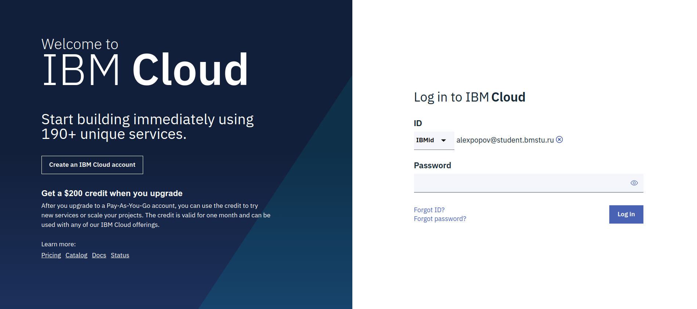
**Облачная платформа PaaS IBM Cloud**


**Дополнительные источники литературы по данному разделу:**

- [Описание ресурсов IBM Cloud](https://www.ibm.com/ru-ru/cloud)
- [Introduction to IBM Watson Studio](https://developer.ibm.com/articles/introduction-watson-studio/)

## Облачная платформа *IBM Cloud* <a name="6_2"></a>

***IBM Cloud*** — это открытое облачная система типа PaaS
(*Platform-as-a-Service*) на базе проекта с открытым исходным кодом Cloud Foundry. Эта платформа предназначена для разработки и хостинга приложений, а также упрощения задач по управлению инфраструктурой. Она позволяет быстро создавать и развертывать приложения, а также управлять ими.

***IBM Cloud*** обеспечивает следующие возможности:

-   быстрое и инкрементное составление приложений из сервисов;
-   непрерывное внесение изменений в приложения и обеспечение постоянной доступности;
-   поддержка высокоспециализированных моделей программирования и сервисов для конкретных рабочих нагрузок;
-   встраивание высокой степени управляемости в сервисы и приложения;
-   оптимизация и эластичная адаптация к рабочей нагрузке.


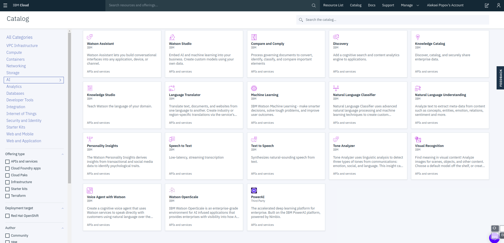
**Каталог компонентов IBM Cloud**


Платформа *IBM Cloud* достигает этих целей посредством абстрагирования и скрытия большинства сложностей, традиционно сопутствующих хостингу приложений в облаке и управлению ими в облачной среде. *IBM Cloud* может быть использована разработчиками для создания и применения самых разных приложений, включая веб-приложения, мобильные приложения, приложения для работы с большими данными, приложения для разумных устройств и т.д. *IBM Cloud* поддерживает разработку на популярных языках программирования и средах разработки. Java-технологии, средства создания серверных частей для мобильных приложений, мониторинг приложений, технологии с открытым исходным кодом и т. д. — все эти возможности
доступны в облаке как сервисы.

Каталог *IBM Cloud* содержит большую часть из того, что необходимо для быстрого начала работы, большое количество шаблонов, заранее сконфигурированны наборов сервисов, сред исполнения и примеров кода, готовых к использованию:

-   инструментов и библиотек обработки данный: R Studion, Jupyter Notebooks, Streams flow editor, SPSS Modeler, Spark MLlib modeler, Decision Optimization model builder и других;
-   сред исполнения, в том числе: Liberty for Java, Node.js, Ruby on Rails;
-   веб-сервисов и сервисов приложений, в том числе: Data/Session Cache,  ElasticMQ, Decision, SSO, Log Analysis, Redis, RabbitMQ, Twilio;
-   мобильных сервисов, в том числе: push-уведомлений, Cloud Code,     Mobile Application Management, Mobile Quality Assurance;
-   сервисов управления данными, в том числе: MongoDB, реляционной базы данных от IBM, JSON-базы данных от IBM, MySQL, PostgreSQL, MobileData, Mobile Sync, BLU Data Warehouse, MapReduce;
-   сервисов мониторинга и анализа;
-   сервисов DevOps Services (прежнее название: JazzHub).
-   проприетарные сервисы IBM, включая аналитическую систему SPSS и другие. 
-   когнитивные сервисы IBM Watson.


**Компоненты IBM Cloud для анализа данных и ИИ**


****
### Краткое описание концепций *IBM Cloud* <a name="6_2_1"></a>


В терминологии *IBM Cloud* приложение (*application*) — это созданный вами артефакт, т. е. весь программный код (исходный код или исполняемые двоичные файлы), который необходимо запустить или на который необходимо сослаться в процессе исполнения. Мобильные приложения выполняются за пределами среды *IBM Cloud* и используют сервисы *IBM Cloud*, представленные приложениями. В случае веб-приложений приложение — это код, загруженный на платформу *IBM Cloud* с целью хостинга. Кроме того, платформа *IBM Cloud* способна осуществлять хостинг программного кода приложения, который вы хотите выполнять на внутреннем сервере в среде на базе контейнера.

На рисунке показаны принципы взаимодействия *IBM Cloud* с клинтскими приложениями.


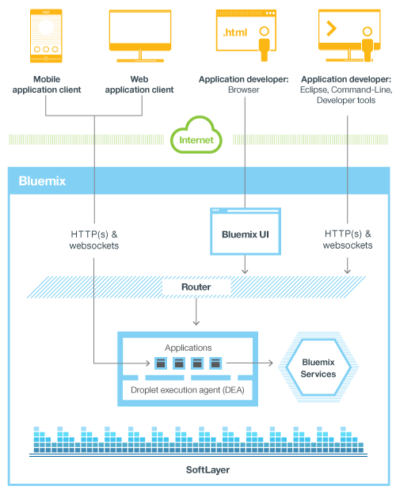
**Принципы взаимодействия *IBM Cloud* с клинтскими приложениями**


***Сервис (service)*** — это код, работающий на платформе *IBM Cloud* и предлагающий некоторую функциональность, которую могут использовать приложения. Это может быть готовый сервис, используемый непосредственно — например, push-уведомления для мобильных приложений или эластичное кэширование для веб-приложения. Вы также можете создавать собственные сервисы в диапазоне от простых служебных функций до сложной
бизнес-логики.

***Организация (organization) и пространство (space)*** — это организационные единицы инфраструктуры, способные хранить и отслеживать ресурсы приложения. Организация содержит домены (domain), пространства и пользователей. Пространство содержит приложения и сервисы. По умолчанию используется три пространства: Development (разработка), Production (производство) и Staging (подготовка). Для приложений, которым требуется среда типа PaaS, предоставляются buildpack-пакеты, каждый из которых представляет собой набор скриптов для подготовки кода к исполнению на целевой PaaS-платформе. Buildpack-пакеты, которые включают необходимую вашим приложениям среду исполнения и могут также содержать специализированные инфраструктуры, упрощают развертывание приложения в облаке по сравнению с самостоятельной установкой и конфигурированием среды исполнения.

Использование сервисов в *IBM Cloud* включает три этапа:
1.  Сообщите платформе *IBM Cloud*, что вам требуется новый экземпляр сервиса и какое конкретное приложение будет использовать этот новый экземпляр.
2.  *IBM Cloud* автоматически инициализирует новый экземпляр этого сервиса и свяжет его с приложением.
3.  Приложение взаимодействует с сервисом.

***Пакеты сервисов (Service bundles)*** — это коллекции API-интерфейсов, используемых в конкретных областях. Например, пакет Mobile Services включает сервисы MobileData, Cloud Code, Push и Mobile Application Management. Доступные сервисы и среды исполнения представлены в каталоге IBM Cloud. Кроме того, вы можете зарегистрировать собственные сервисы.

****
### Развертывание и управление приложением <a name="6_2_2"></a>

Чтобы развернуть свое приложение, необходимо загрузить его в среду *IBM Cloud* и указать, сколько экземпляров этого приложения должно исполняться, а затем сконфигурировать *IBM Cloud*, введя необходимую информацию для поддержки этого приложения.

В случае мобильного приложения среда *IBM Cloud* содержит артефакт, который представляет серверную часть мобильного приложения — набор сервисов, который использует приложение для взаимодействия с сервером. *IBM Cloud* поддерживает серверные компоненты мобильного приложения, взаимодействующие с сервисами PushWorks, Cloud Code и Mobile Data, непосредственно из пользовательского интерфейса *IBM Cloud*.

В случае веб-приложения необходимо предоставить в *IBM Cloud* соответствующую информацию о среде исполнения и среде разработки, чтобы платформа смогла сформировать надлежащую инфраструктуру для исполнения этого приложения.

При развертывании приложений и управлении ими можно использовать инструмент командной строки cf, веб-интерфейс *IBM Cloud* или сервисы DevOps Services.

Браузерные и мобильные клиенты — а также другие приложения, развернутые на платформе *IBM Cloud* и выполняющиеся за ее пределами — взаимодействуют с приложениями, работающими на платформе *IBM Cloud*, через API-интерфейсы типа REST/HTTP. Каждый клиентский запрос маршрутизируется к одному из экземпляров приложения или составляющих его сервисов. Среды исполнения приложений в *IBM Cloud* изолированы друг от друга даже тогда, когда они находятся на одной и той же физической машине.

В ходе управления приложениями можно запускать, останавливать, перезапускать экземпляры приложения (или, в случае веб-приложения, изменять их количество), а также изменять объем памяти, используемый приложением. Ключевая конструктивная особенность *IBM Cloud* — отличные показатели при хостинге масштабируемых приложений и артефактов приложений. На данный момент эта платформа не масштабирует приложение автоматически в соответствии с нагрузкой, поэтому этим процессом необходимо управлять самостоятельно посредством создания или удаления экземпляров при изменении рабочей нагрузки. По этой причине ваши приложения должны сохранять все персистентные данные за пределами приложения в одном из сервисов хранения данных, предоставляемых платформой *IBM Cloud*. При повторном развертывании приложения после обновления используется тот же процесс, что и при начальном развертывании. *IBM Cloud* останавливает все исполняющиеся экземпляры и переводит новые экземпляры в рабочее состояние автоматически.

## Развертывание модели для прогнозирования сердечной недостаточности в IBM Watson Studio <a name="6_3"></a>


В этом задании мы создадим модель ML для прогнозирования сердечной недостаточности и представим его в виде веб-приложения. Проект состоит из двух частей:
-    Прогнозирующая модель хочет быть построена с использованием Spark в блокноте Jupyter в IBM Watson Studio. Затем модель развертывается в службе машинного обучения Watson, где к ней можно получить доступ через REST API.

-    Веб-приложение Node.js, которое позволяет пользователю вводить данные для оценки по сравнению с предыдущей моделью.


**Архитектура решения**

Решение состоит из следующих компонент:

-    Apache Spark используется в качестве основы для реализации распределённой обработки неструктурированных и слабоструктурированных данных.

-    IBM Watson Studio использует облачное хранилище для управления наборами данными.

-    Jupyter Notebooks используется для импорта данных, обучения и оценки своей модели.

-    Данные импортируются и хранятся в облачном хранилище объектов IBM Watson Studio.

-    Модели, обученные с помощью Jupyter, развертываются с помощью сервиса машинного обучения Watson.

-    Веб-приложение Node.js развернуто в IBM Cloud, оно вызывает прогностическую модель, размещенную в службе машинного обучения Watson в ответ на запрос пользователя.

-    Пользователь использует веб-приложение для ввода данных и визуализации результатов.


### Создание проекта и хранилища данных в IBM Watson Studio <a name="6_3_1"></a>

Войдите в IBM Watson Studio. 

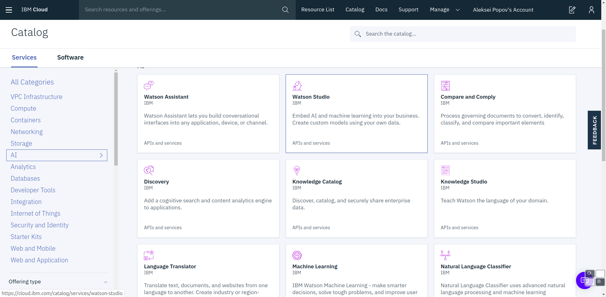

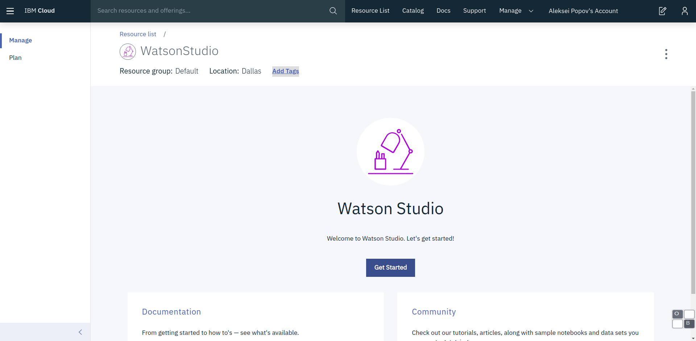

Создайте новый проект, нажав New Project и выберете Create an empty project:


Введите имя для имени проекта и нажмите «Создать».

Данные, использованные в этом примере, были сгенерированы с использованием нормального распределения. Для создания модели используются такие атрибуты, как возраст, пол, частота сердечных сокращений, количество минут в неделю и уровень холестерина.

Сачайте набор данных [тут](data/heartdata.csv)

На панели «Обзор» нового проекта нажмите «+ Add to project» в правом верхнем углу и выберите тип актива «Data».

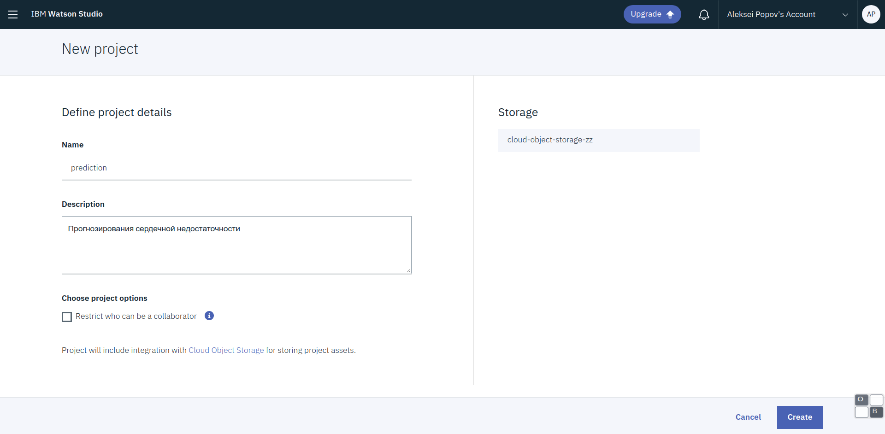

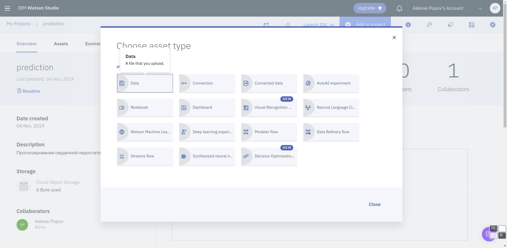

Нажмите на меню навигации слева (☰), чтобы отобразить дополнительные параметры. Выберете опцию Watson Services.

На странице нажмите + Add service в правом верхнем углу и выберите службу Machine Learning. Выберите план Lite.

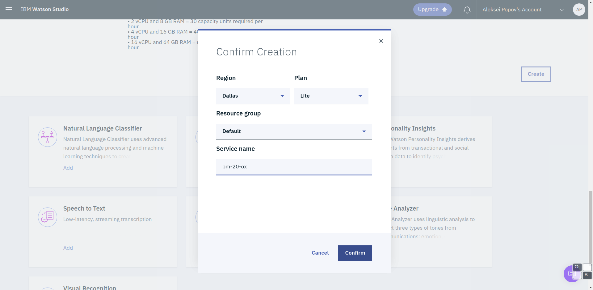


После развертывания вы должны увидеть новый сервис на странице обзора Watson Services. Выберите сервис, открыв ссылку в новой вкладке. 

Сейчас мы находимся в инструменте IBM Cloud, где создадим учетные данные для нашей службы машинного обучения Watson. Выполните пронумерованные шаги на изображении ниже. Мы будем использовать эти учетные данные в Jupyter Notebook для доступа к датасету, поэтому сохраните их.


Вернитесь к проекту через навигационное меню слева (☰).

Записную книжку можно использовать в notebooks /gnativeModel.ipynb, а завершенную версию можно найти в этом [Ноутбуке](data/heartexample.ipynb).

На панели «Обзор» нового проекта нажмите «+ Add to project» в правом верхнем углу и выберите тип ресурса «Notebook». Заполните следующую информацию:

Выберите вкладку From file. Введите имя для записной книжки и при необходимости описание. Укажите путь к скаченному вами файлу heartexample.ipynb.

Для Runtime выберите опцию Spark Python 3.6.


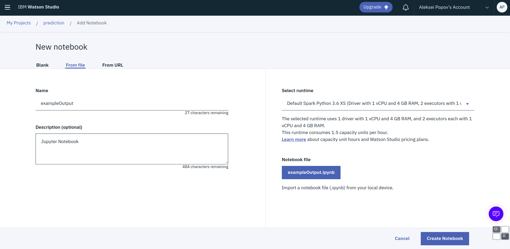

В Notebook перейдите к блоку с кодом:
```
.option('inferSchema','True')\
```

Нажмите на значок данных в правом верхнем углу экрана. Выберите параметр «Insert to code» в файле heartdata.csv.

Выберите пункт «Insert SparkSession Data Frame». В результате в блок будет вставлен код для доступа к Spark сессии.

Переименуйте в коде датасет df_data_1 в df_data.

В вызов метода `spark.read` добавьте строку `.option('inferSchema','True')\` (это необходимо для задания наиболее подходящего типа для каждого столбца датасета):

```python
df_data = spark.read\
  .format('org.apache.spark.sql.execution.datasources.csv.CSVFileFormat')\
  .option('header', 'true')\
  .option('inferSchema','True')\
  .load(cos.url('heartdata.csv', 'prediction-donotdelete-pr-guwuwvhazaddpb'))
```

Перезапустите kernel.

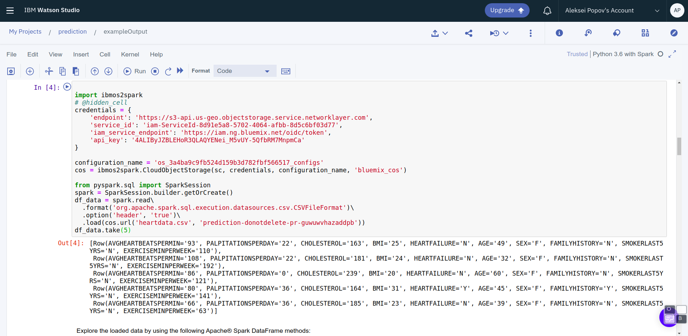


### Развертывание проекта <a name="6_3_2"></a>

Перейдите к пункту 5. Необходимо обновить ячейку с учетными данными  службы ML Watson, которые мы сохранили ранее.

Обновите переменную wml_credentials ниже. 

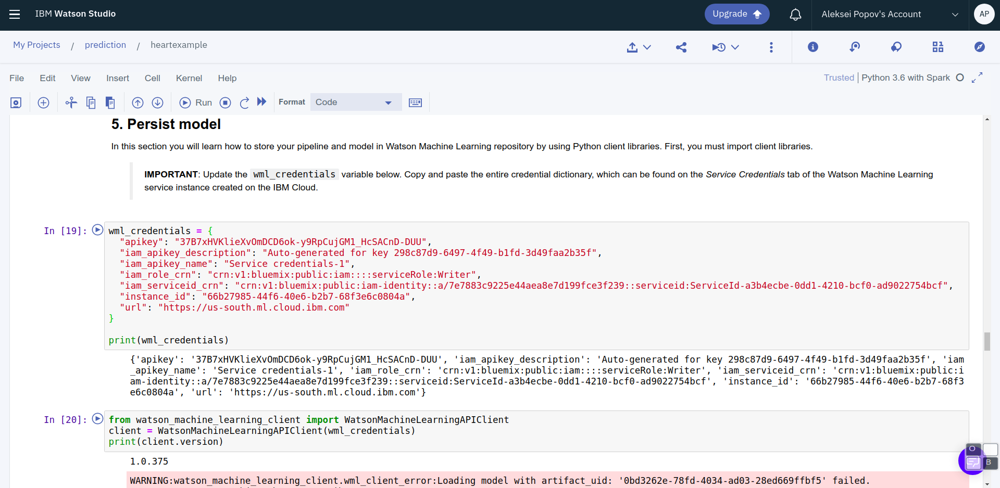

В конце шага 5 прогностические данные будут сохранены и станут доступны для передачи их в веб. 


Дальше мы развернем это приложение с помощью сервиса Cloud Foundry в IBM Cloud. Для этого нам понадобьится

Во время этого процесса вам может быть предложено ввести IBM Cloud API Key. Используйте кнопку «Create (+)» для автоматического заполнения этого и других полей.


**Дополнительные источники литературы по данному разделу:**

- [Пример разработки в IBM Watson Studio](https://github.com/IBM/predictive-model-on-watson-ml)


